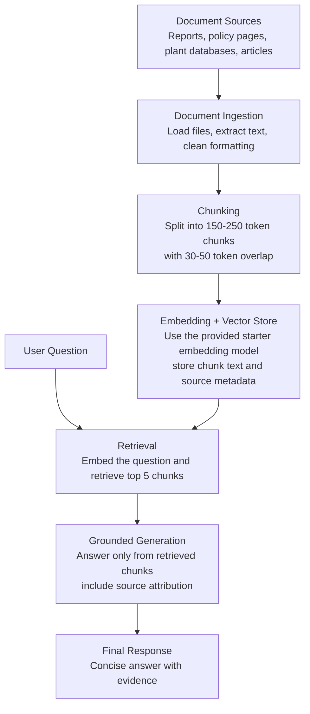

# Project 1 Planning: The Unofficial Guide

> Write this document before you write any pipeline code.
> Your spec and architecture diagram are what you'll use to direct AI tools (Claude, Copilot, etc.) to generate your implementation — the more specific they are, the more useful the generated code will be.
> Update the Retrieval Approach and Chunking Strategy sections if you change your approach during implementation.
> Update this file before starting any stretch features.

---

## Domain

Domain: publicly documented traditional ecological knowledge about climate resilience, forest protection, and relationships with useful plants and trees.

This knowledge is valuable because it records practical, place-based ways that communities understand local ecosystems: how people identify useful plants, protect forests, manage seasonal changes, and maintain relationships with land, water, and trees. It is hard to replace because much of it is embodied through lived experience, oral tradition, and long-term observation rather than formal environmental reports. An unofficial guide in this domain could help users find community-centered environmental knowledge that supports climate adaptation and conservation, while avoiding private, sacred, or culturally restricted knowledge.

<!-- What domain did you choose? Why is this knowledge valuable and hard to find through official channels? -->

---

## Documents

<!-- List your specific sources: URLs, subreddit names, forum threads, or file descriptions.
     Aim for at least 10 sources that together cover different subtopics or perspectives within your domain. -->

| # | Source | Description | URL or location |
|---|--------|-------------|-----------------|
| 1 | IPBES Global Assessment (2019) | Core biodiversity & ILK policy platform | [ipbes.net](https://ipbes.net/) |
| 2 | UNESCO/UNU — *Weathering Uncertainty* (2012) | TEK + climate adaptation case studies | [unesdoc.unesco.org](https://unesdoc.unesco.org/) |
| 3 | FAO — Indigenous Peoples Portal | Forestry, agroecology, resilience | [fao.org/indigenous-peoples](https://www.fao.org/indigenous-peoples/en/) |
| 4 | UNFCCC — LCIPP | Policy exchange on indigenous climate action | [unfccc.int/lcipp](https://unfccc.int/topics/local-communities-and-indigenous-peoples-platform) |
| 5 | UN DRIP Background Resources | Legal + rights framing for IK | [un.org/indigenouspeoples](https://www.un.org/development/desa/indigenouspeoples/declaration-on-the-rights-of-indigenous-peoples.html) |
| 6 | eHRAF World Cultures | Ethnographic collections for TEK and plant use | [ehrafworldcultures.yale.edu](https://ehrafworldcultures.yale.edu/) |
| 7 | JSTOR Plants | Plant specimen literature + vernacular names | [plants.jstor.org](https://plants.jstor.org/) |
| 8 | PROTA4U | African useful plants database | [prota4u.org](https://www.prota4u.org/) |
| 9 | Ethnobotany Research & Applications | Open-access peer-reviewed ethnobotany journal | [ethnobotanyjournal.org](https://ethnobotanyjournal.org/) |
| 10 | The Christensen Fund | Biocultural diversity, seed sovereignty NGO resources | [christensenfund.org](https://www.christensenfund.org/) |
| 11 | IPCC AR6 WG2 Ch.18 — *The Role of Indigenous and Local Knowledge in Understanding and Adapting to Climate Change* (2022) | Chapter examining how ILK complements scientific knowledge for adaptation; citable abstract | [researchgate.net](https://www.researchgate.net/publication/362432216_The_Role_of_Indigenous_Knowledge_and_Local_Knowledge_in_Understanding_and_Adapting_to_Climate_Change) |
| 12 | Frontiers in Climate — *Indigenous knowledge in climate adaptation planning: reflections from initial efforts* (2024) | Reviews facilitation methods for involving IK holders in risk-based climate planning; discusses knowledge brokers and inter-cultural complexity | [10.3389/fclim.2024.1393354](https://www.frontiersin.org/journals/climate/articles/10.3389/fclim.2024.1393354/full) |
| 13 | PMC — *Understanding How Indigenous Knowledge Contributes to Climate Change Adaptation and Resilience: A Systematic Literature Review* (2024) | Systematic review of 14,879 papers synthesizing peer-reviewed evidence on IK–climate resilience links, 2014–2024 | [PMC11549107](https://www.ncbi.nlm.nih.gov/pmc/articles/PMC11549107/) |
| 14 | Ecology & Society — *Making room for meaningful inclusion of ILK in global assessments* (2025) | Reflections from IPBES Values Assessment lead authors on integrating ILK holders; discusses epistemic tensions | [ecologyandsociety.org](https://ecologyandsociety.org/vol30/iss1/art16/) |
| 15 | Journal of Forest Research (OA) — *Traditional Ecological Knowledge and its Impact on Forest Resilience*, Houle (2024) | Reviews how TEK enhances forest resilience through fire management, selective harvesting, species monitoring; CC-BY open access | [10.35248/2168-9776.24.13.519](https://www.longdom.org/open-access/traditional-ecological-knowledge-and-its-impact-on-forest-resilience-109105.html) |
| 16 | Forests, Trees and Livelihoods — *A review of TEK in resilient livelihoods and forest ecosystems*, Tran et al. (2024) | Reviews TEK's contribution to forest ecosystem science; covers methods for bridging TEK with Western science | [10.1080/14728028.2024.2408725](https://www.tandfonline.com/doi/abs/10.1080/14728028.2024.2408725) |
| 17 | Int'l Journal of Biodiversity Science — *Traditional knowledge for sustainable forest management*, Parrotta et al. (2016) | Taxonomizes shared characteristics of traditional forest-related knowledge systems globally: sustainability, reciprocity, identity, limits on exchange | [10.1080/21513732.2016.1169580](https://www.tandfonline.com/doi/full/10.1080/21513732.2016.1169580) |
| 18 | Journal of Ethnobiology & Ethnomedicine — *Integrating TEK into habitat restoration* (Springer, 2023) | Documents TEK on 31 woody tree species used to restore a degraded elephant corridor in India; includes use-value tables | [link.springer.com](https://link.springer.com/article/10.1186/s13002-023-00606-3) |
| 19 | Frontiers in Environmental Science — *TEK and its role in biodiversity conservation: a systematic review* (2023) | Africa-focused review of 47 papers; analyzes taboos, totems, and sacred forests in protecting threatened species | [10.3389/fenvs.2023.1164900](https://www.frontiersin.org/journals/environmental-science/articles/10.3389/fenvs.2023.1164900/full) |
| 20 | Frontiers in Sustainable Food Systems — *Food laborers as stewards of island biocultural diversity* (2023) | How smallholder island farmers embed biocultural knowledge in harvest timing and seed distribution as climate resilience | [10.3389/fsufs.2023.1093341](https://www.frontiersin.org/journals/sustainable-food-systems/articles/10.3389/fsufs.2023.1093341/full) |
| 21 | WIREs Climate Change — *The UN LCIPP: A TEK-based evaluation*, Shawoo (2019) | Critical evaluation of the UNFCCC LCIPP's capacity to incorporate TEK; identifies structural barriers around power and colonialism | [10.1002/wcc.575](https://wires.onlinelibrary.wiley.com/doi/10.1002/wcc.575) |
| 22 | Frontiers in Sustainable Food Systems — *Strengthening the economic sustainability of community seed banks*, De Falcis et al. (2022) | Covers how community seed banks conserve agrobiodiversity and enable seed/food sovereignty in low-income countries | [10.3389/fsufs.2022.803195](https://www.frontiersin.org/journals/sustainable-food-systems/articles/10.3389/fsufs.2022.803195/full) |
| 23 | FAO — State of the World's Forests 2024 | Flagship biennial report on community forest governance, indigenous land tenure, and forest ecosystem service trends | [openknowledge.fao.org](https://openknowledge.fao.org/) |
| 24 | Nature Climate Change — *Community forest governance and synergies among carbon, biodiversity and livelihoods*, Fischer et al. (2023) | Quantitative study showing community-governed forests produce co-benefits across carbon, biodiversity, and livelihoods | [10.1038/s41558-023-01863-6](https://www.nature.com/articles/s41558-023-01863-6) |
| 25 | MDPI Sustainability — Special Issue: *Biocultural Diversity as a New Emerging Concept for Sustainable Landscape Management* | Open-access collection mapping biocultural diversity in cultural landscapes; good for chunking individual papers | [mdpi.com/sustainability](https://www.mdpi.com/journal/sustainability/special_issues/biocultural_diversity) |

---

## Chunking Strategy

<!-- How will you split documents into chunks?
     State your chunk size (in tokens or characters), overlap size, and explain why those
     numbers fit the structure of your documents.
     A review-heavy corpus warrants different chunking than a long FAQ. -->

**Chunk size:**  
Around 150-250 tokens, or roughly 120-200 words.

**Overlap:**  
Around 30-50 tokens, or roughly 20-40 words.

**Reasoning:**  
The sources are likely to contain reports, case studies, policy pages, and ethnobotanical descriptions where important ideas are usually grouped by paragraph. A 150-250 token chunk is large enough to preserve one complete idea, such as a plant use, climate adaptation practice, forest-management method, or community example, without mixing too many unrelated topics. A 30-50 token overlap helps prevent key context from being lost when a paragraph boundary splits related information, such as the community name, plant name, location, and practice description.

---

## Retrieval Approach

<!-- Which embedding model are you using (e.g., all-MiniLM-L6-v2 via sentence-transformers)?
     How many chunks will you retrieve per query (top-k)?
     If you were deploying this for real users and cost wasn't a constraint, what tradeoffs
     would you weigh in choosing a different embedding model — context length, multilingual
     support, accuracy on domain-specific text, latency? -->

**Embedding model:**
I would use [intfloat/multilingual-e5-base](https://huggingface.co/intfloat/multilingual-e5-base). Traditional ecological knowledge corpora routinely contain place names, plant names, and community terminology drawn from indigenous and regional languages, making multilingual embedding support a hard requirement rather than a nice-to-have. The multilingual-e5-base covers 100+ languages, produces 768-dim vectors with stronger domain transfer than MiniLM-class models, and still runs efficiently enough for a research-scale deployment. Its 512-token context window accommodates the longer descriptive passages typical of ethnobotanical and land-use documents.

**Top-k:**
I will retrieve the top 5 chunks for each query. Five chunks should give the generator enough evidence from multiple sources without adding too much unrelated context. If the answers are too broad or include irrelevant evidence, I will reduce top-k to 3; if answers are missing important context, I will test top-k values of 6-8.

**Production tradeoff reflection:**
If this were deployed for real users and I were allowed to choose the embedding model, I would compare models based on accuracy for traditional ecological knowledge, multilingual support, context length, latency, and whether the model can run locally. Multilingual support would matter because source documents may include place names, community names, and plant names from many languages. Higher accuracy and longer context could improve retrieval for domain-specific passages, but may increase cost and response time. For this project, since the embedding model is fixed, I will evaluate retrieval quality through test questions and adjust chunking or top-k instead of changing models.

---

## Evaluation Plan

 Expected answer |
|---|----------|-----------------|
| 1 | What plant species do [community name] communities use to treat fever, and how is it prepared? | A specific plant name (common + scientific), preparation method (e.g., decoction of bark, poultice of leaves), and the community or region it is attributed to. |
| 2 | What seasonal indicators do indigenous groups in [region] use to determine when to begin planting? | Specific ecological cues — e.g., flowering of a particular tree, bird migration, lunar cycle — tied to a named community or place. |
| 3 | How do [community name] land management practices differ between dry and wet seasons? | Distinct practices named for each season (e.g., controlled burns in dry season, rotational fallowing in wet season) with attribution to a source document or community. |
| 4 | Which animal species are considered sacred or subject to harvest restrictions by communities in [region], and what is the stated reason? | Named species, the nature of the restriction (taboo, seasonal ban, ceremonial use only), and the cultural or ecological rationale given in the source. |
| 5 | What traditional water management techniques are documented for communities living in [ecosystem type, e.g., arid highlands / river deltas]? | Named techniques (e.g., terrace irrigation, sand dams, flood-retreat agriculture) with geographic and community attribution. |

---

## Anticipated Challenges

<!-- What could go wrong? Name at least two specific risks with reasoning.
     Consider: noisy or inconsistent documents, missing source attribution, off-topic
     retrieval, chunks that split key information across boundaries. -->

1. Some documents may be noisy or inconsistent because the sources come from different formats, such as policy pages, academic articles, plant databases, and NGO reports. They may use different names for the same plant, practice, community, or region. This could make retrieval harder if a user asks a question using one term while the document uses another, causing the system to return only partially relevant chunks.

2. Source attribution and cultural context could be lost if the chunks are not structured carefully. Traditional ecological knowledge is usually tied to a specific community, place, ecosystem, or source document. If the retrieved chunk includes a plant use or climate practice but not the community or location connected to it, the final answer might sound too general or may present place-based knowledge without enough context.

3. Important information may be split across chunk boundaries. For example, one paragraph might introduce the community and region, while the next paragraph explains the forest-management or water-management practice. If only one of those chunks is retrieved, the model may answer with incomplete evidence, weak attribution, or missing details.

---

## Architecture

<!-- Draw a diagram of your pipeline showing the five stages:
     Document Ingestion → Chunking → Embedding + Vector Store → Retrieval → Generation
     Label each stage with the tool or library you're using.
     You can use ASCII art, a Mermaid diagram, or embed a sketch as an image.
     You'll use this diagram as context when prompting AI tools to implement each stage. -->

The pipeline starts by collecting source documents and converting them into clean text. The text is split into overlapping chunks so each passage keeps enough context for retrieval. The project uses the embedding model provided by the starter environment, then stores each embedded chunk with metadata such as source title, URL or file path, and topic. When a user asks a question, the system retrieves the top 5 most relevant chunks and passes only that evidence into the generation step, so the final answer stays grounded in the documents.

---

## AI Tool Plan

<!-- For each part of the pipeline below, describe:
     - Which AI tool you plan to use (Claude, Copilot, ChatGPT, etc.)
     - What you'll give it as input (which sections of this planning.md, which requirements)
     - What you expect it to produce
     - How you'll verify the output matches your spec

     "I'll use AI to help me code" is not a plan.
     "I'll give Claude my Chunking Strategy section and ask it to implement chunk_text()
     with my specified chunk size and overlap" is a plan. -->

I will use ChatGPT or Claude as coding assistants, but I will give them specific sections of this plan instead of asking for generic help. For each milestone, I will provide the relevant requirements, ask for a focused implementation, and then verify the result against this planning document.

**Milestone 3 - Ingestion and chunking:**

I will give the AI my Domain, Documents, and Chunking Strategy sections, plus the requirement that chunks should be around 150-250 tokens with 30-50 tokens of overlap. I expect it to produce functions that load documents from the `documents/` folder, clean the text, split it into chunks, and preserve metadata such as source name, file path, and chunk number. I will verify the output by printing several sample chunks and checking that they are readable, close to the target size, and still include enough context to understand the passage.

**Milestone 4 - Embedding and retrieval:**

I will give the AI my Retrieval Approach section and clearly state that I cannot choose or replace the embedding model. I expect it to produce code that embeds each chunk using the starter environment's provided model, stores the embeddings with metadata, embeds the user question, and retrieves the top 5 most relevant chunks. I will verify this by running my evaluation questions and checking whether the retrieved chunks contain evidence needed to answer each question.

**Milestone 5 - Generation and interface:**

I will give the AI my Architecture, Retrieval Approach, and Evaluation Plan sections, especially the rule that answers must be grounded only in retrieved chunks. I expect it to produce code that takes a user question, retrieves relevant chunks, formats them as context for the language model, and returns an answer with source attribution. I will verify the output by testing the five evaluation questions, checking whether each answer is supported by the retrieved evidence, and recording any failure cases in the final report.